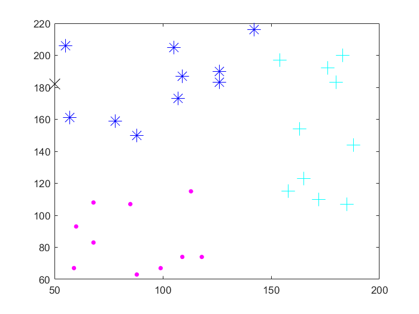
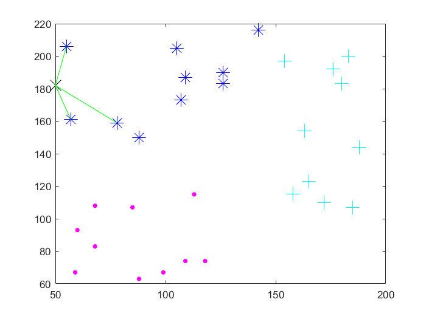
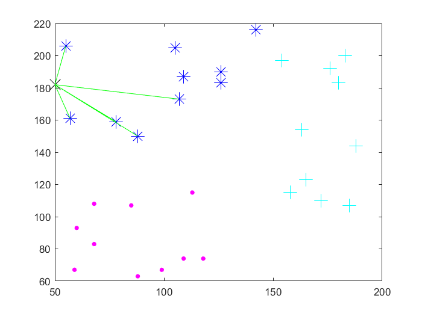

# KNN SINIFLANDIRILMASI

- Sýnýflandýrmada kullanýlan bu algoritmaya göre sýnýflandýrma sýrasýnda çýkarýlan özelliklerden (feature extraction), sýnýflandýrýlmak istenen yeni bireyin daha önceki bireylerden k tanesine yakýnlýðýna bakýlmasýdýr.
Örneðin k = 3 için yeni bir eleman sýnýflandýrýlmak istensin. bu durumda eski sýnýflandýrýlmýþ elemanlardan en yakýn 3 tanesi alýnýr. Bu elamanlar hangi sýnýfa dahilse, yeni eleman da o sýnýfa dahil edilir. Mesafe hesabýndan genelde öklit mesafesi kullanýlabilir...[KNN nedir?](http://bilgisayarkavramlari.sadievrenseker.com/2008/11/17/knn-k-nearest-neighborhood-en-yakin-k-komsu/)

- Proje içerisinde rastgele 3 sýnýf oluþturulmaktadýr.

	
	
	Oluþturulan sýnýflardan sonra yine rastgele olacak þekilde bir bilinmeyen (X) nesnesi oluþturulur. Daha sonra bu oluþturulan nesnenin hangi sýnýfa ait olduðunu bulabilmek için ilk önce k=3 deðeri için sýnýflar kontrol edilir.
	
	
	
	Sýnýflandýrma iþlemini kesinleþtirmek için k=5 deðeri için de kontrol edilir.
	
	
	
	